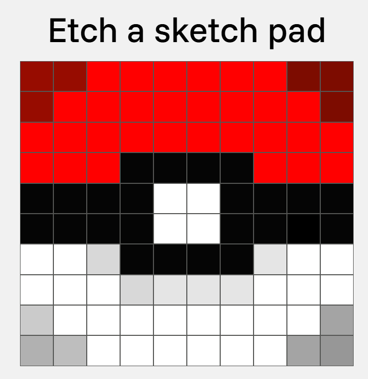

# Etch-a-sketch-pad

A simple sketch-pad that lets
you select each grid boxes to draw a pixel-like shapes or forms.

Here are the features and tools that you can use to draw on the sketch pad:

1. Pen color picker - Lets you select the Color of the Pen.

2. Fill color picker - Lets you select the background color of the sketch pad.

3. Pen tool - Lets you draw on the grid lines.

4. Fill tool - Let's you change the color of the background color of the sketch pad based on the selected color on the Fill color picker.

5. Dark shading tool - This can be used to dark shade the grid cells.

6. Rainbow tool - If you want to draw different colors on each, this is a fun tool for you!

7. Erase tool - erase a one cell manually.

8. Erase all tool - Lets you erase all of the drawings that you made.
